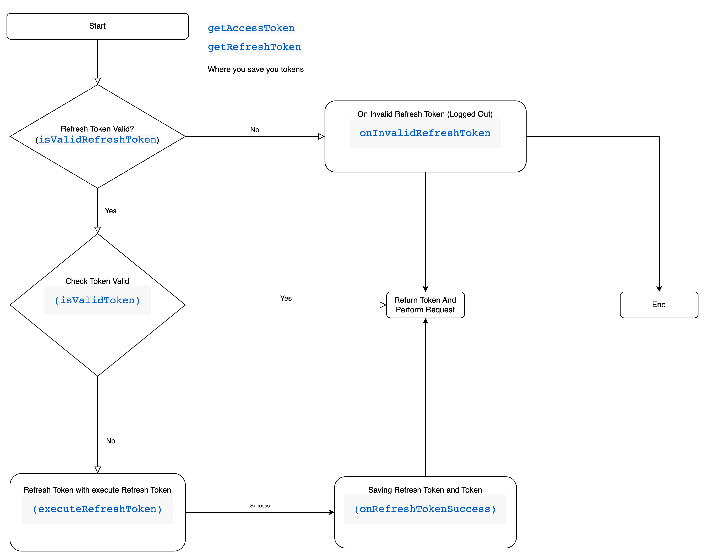
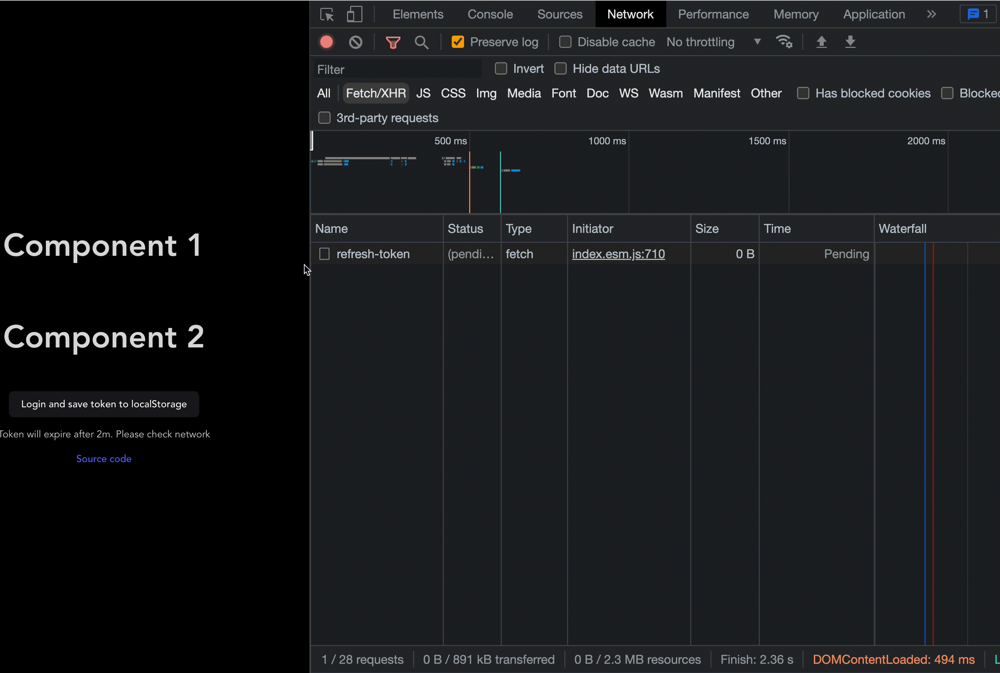
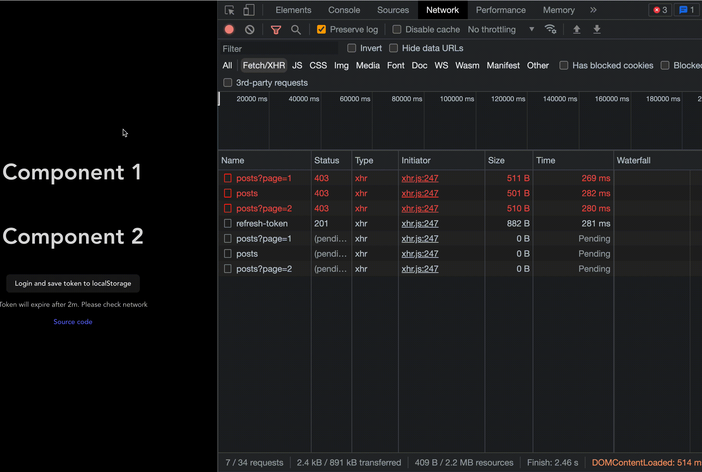

# Brainless Token Management :)

[](https://badge.fury.io/js/brainless-token-manager) [](https://www.npmjs.com/package/brainless-token-manager) [](https://www.npmjs.com/package/brainless-token-manager)
[](#contributors-)

[Live Demo](https://reactjs-handle-refresh-token.vercel.app/)

## Installation

[](https://nodei.co/npm/brainless-token-manager/)

## To install the latest stable version:

```
npm install --save brainless-token-manager@latest

or

yarn add brainless-token-manager
```

## Introduction

- This package help you do refresh token brainlessly

## Flow

- Checking refresh token -> expired -> onInvalidRefreshToken -> clear token on your storage -> logout
- Valid token -> return token -> run as normal
- Token in valid -> refresh token -> onRefreshToken success -> save token and refresh token to storage -> perform request

## Super easy to use

### API

```typescript
// Works fine with JWT
// if you use other tokens JWT. you need to initialize isValidToken and isValidRefreshToken
interface TokenManagerContructor {
  getAccessToken: () => Promise<string>;
  getRefreshToken: () => Promise<string>; // if you don't have refresh token use the same as getAccessToken
  executeRefreshToken?: () => Promise<{ token: string; refresh_token: string }>;
  onRefreshTokenSuccess?: ({ token, refresh_token }: { token: string; refresh_token: string }) => void;
  onInvalidRefreshToken: () => void; // will trigger when refresh token expired
  isValidToken?: (token: string) => Promise<boolean>;
  isValidRefreshToken?: (refresh_token: string) => Promise<boolean>;
  refreshTimeout?: number;
}

const tokenManagerInstance: TokenManager = new TokenManager(options: TokenManagerContructor);
```

### Flow



### Example with umi-request

```javascript
import { extend } from 'umi-request';
import TokenManager, { injectBearer, parseJwt } from 'brainless-token-manager';

// Can implement by umi-request, axios, fetch....
export const requestNew = extend({
  prefix: 'APP_ENDPOINT_URL_HERE',
  headers: {
    'Content-Type': 'application/json',
  },
  errorHandler: (error) => {
    throw error?.data || error?.response;
  },
});

const tokenManager = new TokenManager({
  getAccessToken: async () => {
    const token = localStorage.getItem('accessToken');
    return `${token}`;
  },
  getRefreshToken: async () => {
    const refreshToken = localStorage.getItem('refreshToken');

    return `${refreshToken}`;
  },
  onInvalidRefreshToken: () => {
    // Logout, redirect to login
    localStorage.removeItem('accessToken');
    localStorage.removeItem('refreshToken');
  },
  executeRefreshToken: async () => {
    const refreshToken = localStorage.getItem('refreshToken');

    if (!refreshToken) {
      return {
        token: '',
        refresh_token: '',
      };
    }

    const r = await requestNew.post('/auth/refresh-token', {
      data: {
        refreshToken: refreshToken,
      },
    });

    return {
      token: r?.accessToken,
      refresh_token: r?.refreshToken,
    };
  },
  onRefreshTokenSuccess: ({ token, refresh_token }) => {
    if (token && refresh_token) {
      localStorage.setItem('accessToken', token);
      localStorage.setItem('refreshToken', refresh_token);
    }
  },
});

export const privateRequest = async (request: any, suffixUrl: string, configs?: any) => {
  const token: string = await tokenManager.getToken();

  return request(suffixUrl, injectBearer(token, configs));
};

// Use
privateRequest(axios.get, '/example', { params: { 'work': 'ReactNative' } } });
```

## Compare

- TokenManager



- Axios Interceptor


